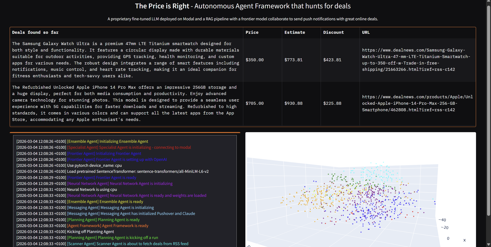
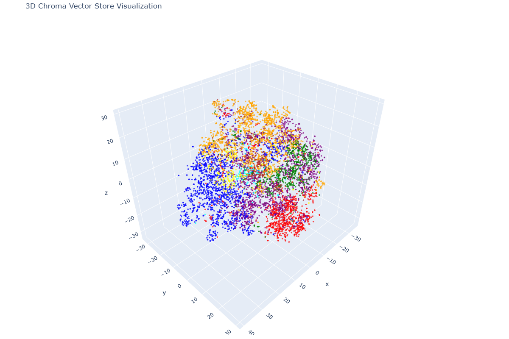

# 🎯 price-watch-multi-agent-platform

FR:

Une plateforme multi-agents orchestrée par LLM qui combine trois techniques de pricing complémentaires : RAG vectoriel sur 800 000 produits Amazon, un modèle Llama 3.2 fine-tuné artisanalement et déployé sur GPU dans le cloud, et un réseau de neurones profond à blocs résiduels. Sept agents spécialisés collaborent en autonomie complète — du scraping de flux RSS à la rédaction et l'envoi de notifications push — sans aucune intervention humaine.

EN:

A LLM-orchestrated multi-agent platform combining three complementary pricing techniques: vector RAG over 800,000 scraped Amazon products, a handcrafted fine-tuned Llama 3.2 model deployed on a cloud GPU, and a deep residual neural network. Seven specialized agents collaborate fully autonomously — from RSS feed scraping to crafting and delivering push notifications — with zero human intervention.
---


<p align="center">
  
</p>

<p align="center">
  
  &nbsp;
  
</p>

## 📖 Sommaire / Table of Contents

- [🇫🇷 Documentation Française](#-documentation-française)
  - [Vue d'ensemble](#vue-densemble)
  - [Architecture](#architecture)
  - [Technologies utilisées](#technologies-utilisées)
  - [Installation & Configuration](#installation--configuration)
  - [Utilisation](#utilisation)
  - [Structure du projet](#structure-du-projet)
  - [Fonctionnement détaillé](#fonctionnement-détaillé)
- [🇬🇧 English Documentation](#-english-documentation)
  - [Overview](#overview)
  - [Architecture](#architecture-1)
  - [Tech Stack](#tech-stack)
  - [Installation & Setup](#installation--setup)
  - [Usage](#usage)
  - [Project Structure](#project-structure)
  - [How it works](#how-it-works)

---

# 🇫🇷 Documentation Française

## Vue d'ensemble

**price-watch-multi-agent-platform** est un framework IA agentique développé en Python qui :

- 📡 **Surveille** les offres publiées sur des flux RSS (électronique, informatique, maison connectée...)
- 💰 **Estime** la valeur réelle de chaque produit grâce à un ensemble de 3 modèles IA
- 🔔 **Notifie** instantanément via notification push lorsqu'une bonne affaire est détectée
- 🧠 **Mémorise** les offres déjà remontées pour éviter les doublons

Le système combine trois techniques d'estimation de prix :
- **RAG** (Retrieval Augmented Generation) avec une base vectorielle de 800 000 produits Amazon scrapés
- Un modèle **Llama 3.2 fine-tuné artisanalement**, déployé sur Modal
- Un **réseau de neurones profond** avec blocs résiduels entraîné sur des données produits

---

## Architecture

```
┌─────────────────────────────────────────────────────────────────┐
│                Interface Gradio  (price_is_right.py)            │
│       Logs temps réel · Tableau des opportunités · t-SNE 3D     │
└───────────────────────────────┬─────────────────────────────────┘
                                │
                    ┌───────────▼───────────┐
                    │   DealAgentFramework  │  ← Mémoire persistante (JSON)
                    │    deal_agent_        │  ← Base vectorielle ChromaDB
                    │    framework.py       │
                    └───────────┬───────────┘
                                │
               ┌────────────────▼────────────────┐
               │         Planning Agent          │
               │  (+ Autonomous Planning Agent   │
               │    avec function calling GPT)   │
               └──────┬──────────┬──────────┬────┘
                      │          │          │
          ┌───────────▼┐  ┌──────▼──────┐  ┌▼──────────────┐
          │  Scanner   │  │  Ensemble   │  │  Messaging    │
          │   Agent    │  │   Agent     │  │    Agent      │
          │            │  │             │  │               │
          │ Flux RSS   │  │ ┌─────────┐ │  │ Claude Sonnet │
          │ DealNews   │  │ │Frontier │ │  │ + Pushover    │
          │ GPT-5-mini │  │ │ Agent   │ │  └───────────────┘
          │ Structured │  │ │GPT-5.1  │ │
          │ Outputs    │  │ │+ RAG    │ │
          └────────────┘  │ │ChromaDB │ │
                          │ ├─────────┤ │
                          │ │Special. │ │
                          │ │ Agent   │ │
                          │ │ Llama   │ │
                          │ │ Modal   │ │
                          │ ├─────────┤ │
                          │ │Neural   │ │
                          │ │Network  │ │
                          │ │ Agent   │ │
                          │ │PyTorch  │ │
                          │ └─────────┘ │
                          └─────────────┘
```

---

## Technologies utilisées

| Catégorie | Technologies |
|---|---|
| **Langage** | Python 3.11+ |
| **APIs LLM** | OpenAI GPT-5.1 / GPT-5-mini, Claude Sonnet (via LiteLLM) |
| **LLM local** | Llama 3.2 (Ollama), Llama 3.2-3B fine-tuné (Modal) |
| **Base vectorielle** | ChromaDB + SentenceTransformers (all-MiniLM-L6-v2) |
| **Réseau de neurones** | PyTorch · Blocs résiduels · HashingVectorizer |
| **Déploiement cloud** | Modal (GPU T4, quantization 4-bit NF4, PEFT/LoRA) |
| **Données** | 800 000 produits Amazon scrapés · RSS feedparser |
| **Scraping** | BeautifulSoup4 · requests · feedparser |
| **Interface** | Gradio · Plotly (visualisation t-SNE 3D) |
| **Notifications** | Pushover API |
| **Modèles de données** | Pydantic · HuggingFace Datasets Hub |
| **Évaluation** | sklearn · Plotly (scatter + courbe d'erreur + IC 95%) |

---

## Installation & Configuration

### Prérequis

- Python 3.11+
- [uv](https://github.com/astral-sh/uv) (gestionnaire de paquets recommandé)
- [Ollama](https://ollama.com/) (pour le preprocessing local avec Llama 3.2)
- Un compte [Modal](https://modal.com)
- Un compte [Pushover](https://pushover.net)
- Une clé API OpenAI
- Une clé API Anthropic

---

### 1. Cloner & installer

```bash
git clone https://github.com/your-username/price-watch-multi-agent-platform.git
cd price-watch-multi-agent-platform
uv sync
```

---

### 2. Configurer Modal

Inscrivez-vous sur [modal.com](https://modal.com), puis allez dans **Settings → API Tokens → New Token** et exécutez :

```bash
uv run modal token set --token-id ak-XXXX --token-secret as-XXXX
```

#### Configurer le secret HuggingFace dans Modal

> ⚠️ **Important :** Le **nom** du secret doit être exactement `huggingface-secret`.

1. Allez sur [modal.com](https://modal.com) → **Secrets** → **Create new secret**
2. Sélectionnez **Hugging Face**
3. Nommez-le : `huggingface-secret`
4. Clé : `HF_TOKEN` / Valeur : `hf_...`
5. Cliquez sur **Done**

---

### 3. Configurer Pushover

Inscrivez-vous sur [pushover.net](https://pushover.net), créez une application (ex. `PriceWatch`), puis ajoutez à votre `.env` :

```env
PUSHOVER_USER=u_...   # En haut à droite de votre dashboard Pushover
PUSHOVER_TOKEN=a_...  # Dans les paramètres de votre application
```

---

### 4. Télécharger les poids du réseau de neurones

Téléchargez `deep_neural_network.pth` ici :

🔗 [Google Drive](https://drive.google.com/drive/folders/1uq5C9edPIZ1973dArZiEO-VE13F7m8MK?usp=drive_link)

Placez le fichier à la racine du projet.

---

### 5. Déployer le modèle Llama fine-tuné sur Modal

```bash
uv run modal deploy pricer_service2.py
```

---

### 6. Variables d'environnement

Créez un fichier `.env` à la racine du projet :

```env
# OpenAI
OPENAI_API_KEY=sk-...

# Anthropic (pour le Messaging Agent)
ANTHROPIC_API_KEY=sk-ant-...

# Notifications Pushover
PUSHOVER_USER=u_...
PUSHOVER_TOKEN=a_...

# Modèle de preprocessing (optionnel, défaut : ollama/llama3.2)
PRICER_PREPROCESSOR_MODEL=ollama/llama3.2
```

---

## Utilisation

### Lancer l'interface Gradio

```bash
uv run python price_is_right.py
```

L'interface s'ouvre dans le navigateur et automatiquement :
- Lance un cycle de recherche de deals au chargement
- Se rafraîchit toutes les 5 minutes
- Affiche les logs en temps réel avec coloration par agent
- Liste toutes les opportunités trouvées dans un tableau
- Affiche une visualisation 3D t-SNE de la base ChromaDB

> 💡 **Cliquez sur une ligne** du tableau pour envoyer manuellement une notification push pour cette offre.

### Lancer sans interface

```bash
uv run python deal_agent_framework.py
```

---

## Structure du projet

```
price-watch-multi-agent-platform/
│
├── agents/
│   ├── agent.py                       # Classe de base abstraite avec logging coloré
│   ├── deals.py                       # Modèles Pydantic : ScrapedDeal, Deal, Opportunity
│   ├── items.py                       # Modèle Item + intégration HuggingFace Hub
│   ├── scanner_agent.py               # Scraping RSS + sélection GPT des deals
│   ├── ensemble_agent.py              # Combinaison pondérée de 3 modèles de prix
│   ├── frontier_agent.py              # GPT-5.1 + RAG ChromaDB
│   ├── specialist_agent.py            # Llama 3.2 fine-tuné via Modal (remote)
│   ├── neural_network_agent.py        # Estimateur PyTorch ResNet profond
│   ├── deep_neural_network.py         # Architecture ResNet + inférence
│   ├── preprocessor.py                # Normalisation des descriptions (LiteLLM)
│   ├── planning_agent.py              # Orchestrateur synchrone (seuil de remise)
│   └── autonomous_planning_agent.py   # Orchestrateur LLM (function calling GPT-5.1)
│
├── deal_agent_framework.py            # Framework principal : ChromaDB + mémoire + t-SNE
├── price_is_right.py                  # Interface Gradio avec logs temps réel
├── pricer_service2.py                 # Déploiement Modal du Llama fine-tuné
├── log_utils.py                       # Convertisseur ANSI → HTML coloré
├── evaluator.py                       # Framework d'évaluation avec graphiques Plotly
├── deep_neural_network.pth            # Poids du réseau de neurones (à télécharger)
├── memory.json                        # Mémoire persistante des deals (auto-généré)
├── products_vectorstore/              # Base ChromaDB persistante (auto-générée)
└── .env                               # Variables d'environnement (non commité)
```

---

## Fonctionnement détaillé

1. Le **ScannerAgent** récupère les flux RSS DealNews, filtre les URLs déjà vues, et demande à GPT-5-mini (avec Structured Outputs) de sélectionner les 5 meilleures offres avec descriptions claires et prix confirmés.

2. Le **Preprocessor** normalise chaque description produit via Llama 3.2 (Ollama) avant de l'envoyer aux modèles de pricing.

3. L'**EnsembleAgent** fait estimer chaque produit par 3 modèles :
   - Le **FrontierAgent** effectue une recherche sémantique dans ChromaDB (800K produits Amazon) pour trouver 5 articles similaires, puis appelle GPT-5.1 avec ce contexte enrichi.
   - Le **SpecialistAgent** appelle le modèle Llama 3.2-3B fine-tuné déployé sur Modal (GPU T4, quantifié en 4 bits NF4 via PEFT/LoRA).
   - Le **NeuralNetworkAgent** exécute un réseau ResNet PyTorch à 10 couches avec skip connections sur un vecteur de caractéristiques haché (5 000 features).

4. Le **PlanningAgent** trie les opportunités par discount. Si la meilleure remise dépasse 50$, il déclenche le **MessagingAgent** qui utilise Claude Sonnet pour rédiger une notification percutante en 2-3 phrases, puis l'envoie via Pushover.

5. L'**AutonomousPlanningAgent** (variante avancée) orchestre le même workflow via function calling GPT-5.1, avec gestion de la mémoire des URLs déjà remontées.

6. Toutes les opportunités sont sauvegardées dans `memory.json` pour éviter les doublons entre les cycles.

---
---

# 🇬🇧 English Documentation

## Overview

**price-watch-multi-agent-platform** is an agentic AI framework built in Python that:

- 📡 **Watches** for deals published on RSS feeds (electronics, computers, smart home...)
- 💰 **Estimates** the true market value of each product using an ensemble of 3 AI models
- 🔔 **Notifies** you instantly via push notification when a great deal is found
- 🧠 **Remembers** previously surfaced deals to avoid duplicates

The system combines three powerful price estimation techniques:
- **RAG** (Retrieval Augmented Generation) with a vector store of 800,000 scraped Amazon products
- A **handcrafted fine-tuned Llama 3.2** model deployed on Modal
- A **Deep Neural Network** with residual blocks trained on product data

---

## Architecture

```
┌─────────────────────────────────────────────────────────────────┐
│                    Gradio UI  (price_is_right.py)               │
│         Real-time logs · Opportunities table · 3D t-SNE plot    │
└───────────────────────────────┬─────────────────────────────────┘
                                │
                    ┌───────────▼───────────┐
                    │   DealAgentFramework  │  ← Persistent memory (JSON)
                    │    deal_agent_        │  ← ChromaDB vector store
                    │    framework.py       │
                    └───────────┬───────────┘
                                │
               ┌────────────────▼────────────────┐
               │       Planning Agent            │
               │  (+ Autonomous Planning Agent   │
               │    with GPT-5.1 function calls) │
               └──────┬──────────┬──────────┬────┘
                      │          │          │
          ┌───────────▼┐  ┌──────▼──────┐  ┌▼──────────────┐
          │  Scanner   │  │  Ensemble   │  │  Messaging    │
          │   Agent    │  │   Agent     │  │    Agent      │
          │            │  │             │  │               │
          │ RSS Feeds  │  │ ┌─────────┐ │  │ Claude Sonnet │
          │ DealNews   │  │ │Frontier │ │  │ + Pushover    │
          │ GPT-5-mini │  │ │ Agent   │ │  └───────────────┘
          │ Structured │  │ │GPT-5.1  │ │
          │ Outputs    │  │ │+ RAG    │ │
          └────────────┘  │ │ChromaDB │ │
                          │ ├─────────┤ │
                          │ │Special. │ │
                          │ │ Agent   │ │
                          │ │ Llama   │ │
                          │ │ Modal   │ │
                          │ ├─────────┤ │
                          │ │Neural   │ │
                          │ │Network  │ │
                          │ │ Agent   │ │
                          │ │PyTorch  │ │
                          │ └─────────┘ │
                          └─────────────┘
```

---

## Tech Stack

| Category | Technologies |
|---|---|
| **Language** | Python 3.11+ |
| **LLM APIs** | OpenAI GPT-5.1 / GPT-5-mini, Claude Sonnet (via LiteLLM) |
| **Local LLM** | Llama 3.2 (Ollama), fine-tuned Llama 3.2-3B (Modal) |
| **Vector DB** | ChromaDB + SentenceTransformers (all-MiniLM-L6-v2) |
| **Neural Network** | PyTorch · Residual blocks · HashingVectorizer |
| **Cloud Deployment** | Modal (GPU T4, 4-bit NF4 quantization, PEFT/LoRA) |
| **Data** | 800,000 scraped Amazon products · feedparser RSS |
| **Scraping** | BeautifulSoup4 · requests · feedparser |
| **UI** | Gradio · Plotly (3D t-SNE visualization) |
| **Notifications** | Pushover API |
| **Data Models** | Pydantic · HuggingFace Datasets Hub |
| **Evaluation** | sklearn · Plotly (scatter + error trend + 95% CI) |

---

## Installation & Setup

### Prerequisites

- Python 3.11+
- [uv](https://github.com/astral-sh/uv) (recommended package manager)
- [Ollama](https://ollama.com/) (for local preprocessing with Llama 3.2)
- A [Modal](https://modal.com) account
- A [Pushover](https://pushover.net) account
- OpenAI API key
- Anthropic API key

---

### 1. Clone & Install

```bash
git clone https://github.com/your-username/price-watch-multi-agent-platform.git
cd price-watch-multi-agent-platform
uv sync
```

---

### 2. Configure Modal

Sign up at [modal.com](https://modal.com), then go to **Settings → API Tokens → New Token** and run:

```bash
uv run modal token set --token-id ak-XXXX --token-secret as-XXXX
```

#### Set your HuggingFace secret in Modal

> ⚠️ **Important:** The secret **name** must be exactly `huggingface-secret`.

1. Go to [modal.com](https://modal.com) → **Secrets** → **Create new secret**
2. Select **Hugging Face**
3. Name it: `huggingface-secret`
4. Key: `HF_TOKEN` / Value: `hf_...`
5. Click **Done**

---

### 3. Configure Pushover

Sign up at [pushover.net](https://pushover.net), create an application (e.g. `PriceWatch`), then add to your `.env`:

```env
PUSHOVER_USER=u_...   # Top right of your Pushover dashboard
PUSHOVER_TOKEN=a_...  # Inside your application settings
```

---

### 4. Download Neural Network weights

Download `deep_neural_network.pth` from:

🔗 [Google Drive](https://drive.google.com/drive/folders/1uq5C9edPIZ1973dArZiEO-VE13F7m8MK?usp=drive_link)

Place it in the root directory of the project.

---

### 5. Deploy the fine-tuned Llama model on Modal

```bash
uv run modal deploy pricer_service2.py
```

---

### 6. Environment variables

Create a `.env` file at the root of the project:

```env
# OpenAI
OPENAI_API_KEY=sk-...

# Anthropic (for Messaging Agent)
ANTHROPIC_API_KEY=sk-ant-...

# Pushover notifications
PUSHOVER_USER=u_...
PUSHOVER_TOKEN=a_...

# Preprocessor model (optional, defaults to ollama/llama3.2)
PRICER_PREPROCESSOR_MODEL=ollama/llama3.2
```

---

## Usage

### Launch the Gradio UI

```bash
uv run python price_is_right.py
```

The UI will open in your browser and automatically:
- Run a deal-hunting cycle on load
- Refresh every 5 minutes
- Display real-time colored logs per agent
- Show all found opportunities in a table
- Render a 3D t-SNE visualization of the ChromaDB vector store

> 💡 **Click any row** in the opportunities table to manually trigger a push notification for that deal.

### Run headless

```bash
uv run python deal_agent_framework.py
```

---

## Project Structure

```
price-watch-multi-agent-platform/
│
├── agents/
│   ├── agent.py                       # Abstract base class with colored logging
│   ├── deals.py                       # Pydantic models: ScrapedDeal, Deal, Opportunity
│   ├── items.py                       # Item model + HuggingFace Hub integration
│   ├── scanner_agent.py               # RSS scraping + GPT deal selection
│   ├── ensemble_agent.py              # Weighted combination of 3 pricing models
│   ├── frontier_agent.py              # GPT-5.1 + ChromaDB RAG pricer
│   ├── specialist_agent.py            # Remote fine-tuned Llama 3.2 via Modal
│   ├── neural_network_agent.py        # PyTorch deep ResNet pricer
│   ├── deep_neural_network.py         # ResNet architecture + inference
│   ├── preprocessor.py                # Product description normalizer (LiteLLM)
│   ├── planning_agent.py              # Synchronous orchestrator (discount threshold)
│   └── autonomous_planning_agent.py   # LLM-driven orchestrator (function calling)
│
├── deal_agent_framework.py            # Main framework: ChromaDB + memory + t-SNE
├── price_is_right.py                  # Gradio UI with real-time logs
├── pricer_service2.py                 # Modal deployment of fine-tuned Llama
├── log_utils.py                       # ANSI → HTML color converter
├── evaluator.py                       # Evaluation framework with Plotly charts
├── deep_neural_network.pth            # Neural network weights (download separately)
├── memory.json                        # Persistent deal memory (auto-generated)
├── products_vectorstore/              # ChromaDB persistent store (auto-generated)
└── .env                               # Environment variables (not committed)
```

---

## How it works

1. **ScannerAgent** subscribes to DealNews RSS feeds, filters out already-seen URLs, and asks GPT-5-mini (with Structured Outputs) to select the 5 most promising deals with clear descriptions and confirmed prices.

2. **Preprocessor** normalizes each product description via Llama 3.2 (Ollama) before sending it to the pricing models.

3. **EnsembleAgent** runs all 3 pricing models on each preprocessed description:
   - **FrontierAgent** performs a semantic search in ChromaDB (800K Amazon products) to find 5 similar items, then sends the description + context to GPT-5.1.
   - **SpecialistAgent** calls the fine-tuned Llama 3.2-3B model deployed on Modal (GPU T4, 4-bit NF4 quantized via PEFT/LoRA).
   - **NeuralNetworkAgent** runs a 10-layer PyTorch ResNet with skip connections on a hashed feature vector (5,000 features).

4. **PlanningAgent** sorts opportunities by discount. If the best discount exceeds $50, it triggers **MessagingAgent**, which uses Claude Sonnet to craft an engaging 2-3 sentence notification and sends it via Pushover.

5. **AutonomousPlanningAgent** (advanced variant) orchestrates the same workflow via GPT-5.1 function calling, with built-in memory of already-surfaced URLs.

6. All surfaced opportunities are saved to `memory.json` to prevent re-alerting on the same deals.

---

<div align="center">
  <sub>Built with ❤️ using Python · OpenAI · Anthropic · Modal · ChromaDB · PyTorch · Gradio</sub>
</div>
